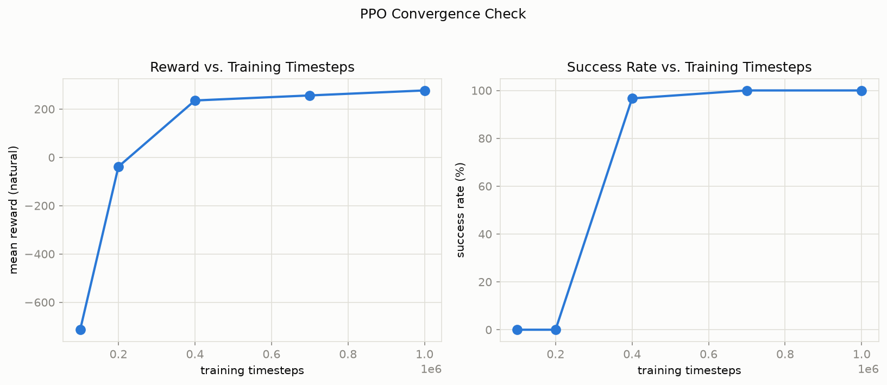
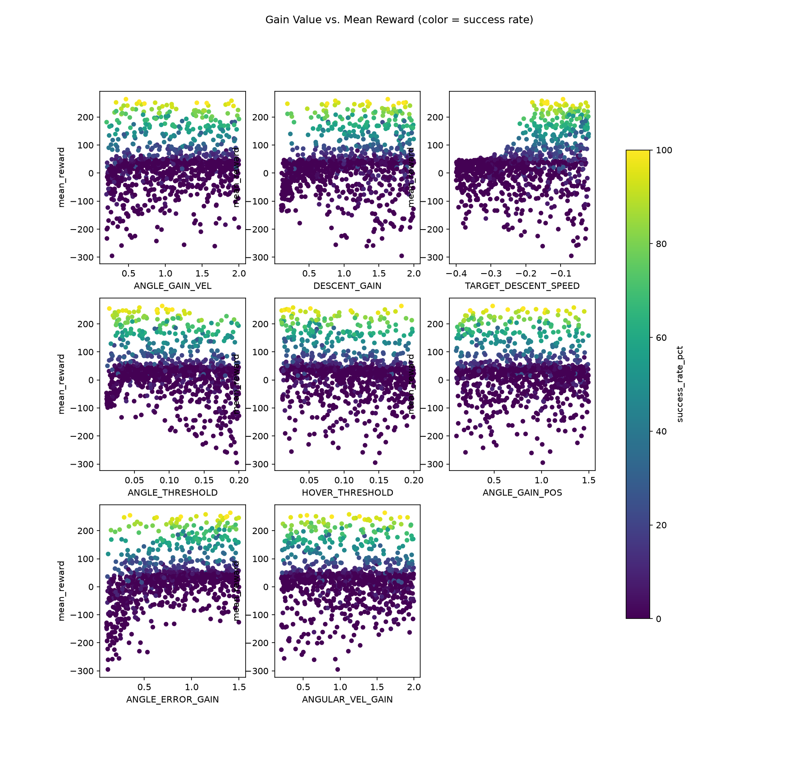

# Investigation: what it took to trust a number

This is the story of trying to make a `LunarLander-v3` controller land
faster, and honestly, most of the effort didn't go into making it faster.
It went into convincing myself the numbers I was getting were actually
real.

Flight time ended up **52% lower** than where I started. The biggest single
win didn't come from reinforcement learning. It came from giving the
classical proportional controller different gains at different altitudes,
which took about fifteen minutes of sampling and left it matching
1M-timestep PPO on speed while beating it on reliability.

But the part I actually want to write about is what it took to believe any
of that in the first place. Seven small-sample results looked decisive and
then fell apart the moment I reran them. Five methodology bugs made it into
conclusions I'd already written down, before I caught them — mostly by
getting suspicious of a number that looked *too* clean. Four planned phases
got killed by an argument on paper instead of an experiment. The metric I
was optimizing against the whole time turned out to be about a quarter
incompressible, no matter what I did. And the "physical floor" I'd been
measuring progress against for two arcs wasn't a floor at all.

This document is about those mistakes, not really about the lander. If you
want the clean version of the method instead of the mess of getting there,
that's in [docs/METHOD.md](docs/METHOD.md).

**Contents**

1. [The setup](#1-the-setup)
2. [Hypothesis: a flat time penalty](#2-hypothesis-a-flat-time-penalty)
3. [The tell: four identical floats](#3-the-tell-four-identical-floats)
4. [The uncomfortable part](#4-the-uncomfortable-part)
5. [Refusing to build on noise](#5-refusing-to-build-on-noise)
6. [Grading your own homework](#6-grading-your-own-homework)
7. [Systematic follow-through](#7-systematic-follow-through)
8. [Where it landed](#8-where-it-landed)
9. [Chasing the ceiling](#9-chasing-the-ceiling)
10. [Where the speed actually went](#10-where-the-speed-actually-went)
11. [Three phases I didn't run](#11-three-phases-i-didnt-run)
12. [Two results that inverted](#12-two-results-that-inverted)
13. [Building better controllers](#13-building-better-controllers)
14. [Techniques, and what I'd do differently](#14-techniques-and-what-id-do-differently)

---

## 1. The setup

Two controllers sit behind one interface:

- **`HeuristicController`** — a hand-built proportional controller. Eight
  gains, five of them tuned by Monte Carlo search over a Latin Hypercube.
- **`RLAgent`** — PPO via Stable-Baselines3.

Both land reliably. Both land *slowly*, hovering their way down, because
the environment's shaping reward doesn't charge rent for time and just
lets that slide.

| | reward | success | landing steps |
|---|---|---|---|
| Heuristic | 246.8 | 97.3% | 401 |
| PPO | 261.2 | 99.3% | 321 |

*Mean of 3 runs each, evaluated on held-out episodes — by the standards I
settled on later in this document, not the ones I started with.*

The obvious lever: charge for time.

## 2. Hypothesis: a flat time penalty

`TimePenaltyWrapper` subtracts a fixed amount from the reward on every
timestep. Six penalty levels, both controllers.

One decision here mattered more than it looked like it would: the penalty
only ever applies during training and search, never during evaluation.
Every number reported below is natural, unpenalized reward. Skip that and
higher penalties would just mechanically drag the score down, and the
whole sweep would end up measuring its own thumb on the scale instead of
anything real.

## 3. The tell: four identical floats

The first heuristic sweep came back with this:

```
penalty 0.10  ->  mean_reward 250.53465997611173
penalty 0.20  ->  mean_reward 250.53465997611173
penalty 0.40  ->  mean_reward 250.53465997611173
```

Four of six levels, identical to fifteen decimal places.

Floating-point results don't agree to fifteen places by accident. Whatever
I thought I was varying, it wasn't reaching the computation.

Turned out `run_monte_carlo` was seeded once, so every penalty level drew
the same 200 gain sets. The penalty wasn't re-searching anything, just
re-ranking a fixed pool. Past a certain threshold the same gain set won
every single time, because it was the same pool every single time.

Looking at the same run again, there was a second bug sitting right next to
it: PPO training was unseeded. The RL half of the sweep showed 0% success
at four of six levels, with rewards swinging from −313 to +90. I was about
to sit down and interpret the shape of that curve. It wasn't a shape. It
was network-init noise.

Fixed both in one commit — vary the search seed per level, pin the PPO
seed across levels. Opposite fixes, but the same idea underneath: the
thing you're studying should vary, and nothing else should.

## 4. The uncomfortable part

The seed fix broke a decision I'd already shipped.

One commit earlier, I'd promoted new gains into
`configs/heuristic_gains.json`, pulled straight from the penalty=0.2 level
of the sweep I'd just proved was broken.

| | shipped (from the buggy run) | corrected run |
|---|---|---|
| mean_reward | 236.6 | 255.6 |
| success | 86.7% | 100% |

The corrected gains won at all three seeds I spot-checked, so I promoted
those instead and wrote the comparison into the commit message. The gains
themselves aren't the point. The point is that fixing a bug has a blast
radius reaching backwards into decisions you already made on the bad
output — and the only way to find that out is to actually go check.

## 5. Refusing to build on noise

Seeds fixed, but the PPO numbers were still untrustworthy for a reason
nobody had actually checked: was 150,000 timesteps even enough to train
the thing at all? That figure had just been inherited from somewhere.
Nobody had validated it. Me included.



| timesteps | reward | success |
|---|---|---|
| 100,000 | **−713.8** | **0%** |
| 200,000 | −38.4 | 0% |
| 400,000 | 235.4 | 96.7% |
| 1,000,000 | 277.0 | 100% |

Below 400k, PPO isn't just noisy, it flat out doesn't work. At the sweep's
150k budget it can't land at all. Every RL number in the study up to this
point had been measuring an untrained network's opinion about reward
shaping, which is to say, nothing.

The penalty sweep hadn't been messed up by undertraining so much as it had
just been measuring it the whole time.

## 6. Grading your own homework

Bug number four is the one I'm least comfortable admitting to, because on
the surface nothing looked wrong at all.

`run_monte_carlo` ranked 200 gain sets on 30 episodes and reported the
best one's score. That score is the maximum of 200 noisy estimates, which
means it's biased upward by construction, and the bias gets worse the more
samples you take. Classic winner's curse. The search wasn't reporting how
good the winner was. It was reporting how lucky it got.

Re-scoring each winner on 100 episodes it had never seen:

| samples searched | reported best | held-out | inflation |
|---|---|---|---|
| 125 | 255.2 | 248.9 | +6.3 |
| 250 | 258.5 | 234.6 | +23.9 |
| 500 | 259.7 | 229.1 | **+30.6** |
| 1000 | 262.4 | 245.0 | +17.4 |

This one nearly talked me into the wrong conclusion. I'd run an 8D gain
search and watched best-found climb steadily with sample count, 255, then
258, then 260, then 262. Read one way that says the search hasn't
converged and needs a smarter optimizer. That was going to be my
justification for building CMA-ES.

On held-out episodes, the climb just isn't there. It was the inflation
growing, not the controller. The smallest search actually generalized the
best.

The fix: rank on the search episodes like before, then re-score the top
few on held-out episodes and let *those* pick the winner. That gets you an
honest number and, as a bonus, an actually better controller:

| selection | held-out reward | held-out success |
|---|---|---|
| naive argmax | 244.2 | 91% |
| held-out selection | **249.3** | **96%** |
| *what the old code advertised* | *264.3* | — |

Grepping for other callers turned up the same argmax logic re-derived
somewhere else inside the sweep, which would have sidestepped the fix
entirely. Same bug, two places it could hide.

## 7. Systematic follow-through

Four checks that mostly came back "no." Writing them down anyway, because
a negative result you can actually point to is worth more than a question
left hanging.

**Are the search bounds too tight?** The top 20 gain sets clustered near
the edge of two bounds. I widened both in the direction the data pointed
— the opposite direction from what I'd predicted, for what it's worth —
and reran. The newly opened regions attracted 2 of 20 and 0 of 20 of the
new top 20, against roughly 0.8 expected by chance. So the bounds were
fine. "Top-20 mean sitting at 80% of the range" turns out not to mean the
same thing as "top-20 pinned at 100%."

**Do the three untuned attitude gains have anything left to give?** No.
The objective surface is flat in them. Three seeds' winners actively
disagree with each other (`ANGULAR_VEL_GAIN` comes out at 1.60, 0.24, and
1.54 across the three) while scoring within 4 reward of each other.



**Are the PPO hyperparameters worth tuning?** Tried 30 configs at 1M
timesteps. The best one, retrained across 3 seeds, ties the defaults on
reward (261.3 vs 261.2), loses on success (89.3% vs 99.3%), and is three
times more seed-variable on top of that. Kept the defaults.

That comparison had to be redone once, too. The first pass said "nothing
beats the defaults" by comparing against a default score of 277.0 — which
was itself a lucky single-seed draw. Measured properly, the defaults sit
at 261.2 ± 4.8. So I'd been benchmarking against an inflated number and
somehow still landing on the right answer, for the wrong reason. Then the
correction briefly looked like a reversal, and the reversal turned out to
be a single-seed artifact too. Three times, in one phase.

**Does the search need CMA-ES?** No, and §6 already explains why. The 8D
space wasn't under-covered, it was overfit. Bolting a stronger optimizer
onto an objective that grades its own homework would just have overfit
harder and faster. Skipped, and written down as skipped.

## 8. Where it landed


Three seeds per point, held-out evaluation, error bars.

On PPO, the penalty works, and there's basically no trade-off to make.

| penalty | reward | success | landing steps |
|---|---|---|---|
| 0.0 | 261.2 ± 4.8 | 99.3% | 321 |
| **0.1** | **272.0 ± 5.3** | **99.0%** | **250** |
| 0.4 | 70.0 ± 17.2 | 13.7% | — |

22% faster, reward slightly higher if anything, success unchanged. Every
single seed lands faster at 0.1 than that same seed did at 0.0. Push it to
0.4 and the policy just collapses.

On the heuristic, it does nothing. Across the whole penalty range, landing
steps move from 401 to 388, against per-point standard deviations of 8 to
30. Flat, basically noise.

That gap has a real mechanism behind it, and it's the most interesting
thing I found in the whole study. The wrapper shapes what PPO *learns* —
it changes the objective the policy is being optimized against while
training. For the heuristic it does something completely different: it
just re-weights an argmax over a fixed pool of 200 gain sets that were
already sampled. No search pressure gets applied. It can't create a faster
controller, it can only prefer one that happened to already be in the
pool. Same wrapper, same penalty value, two totally different mechanisms
underneath, and only one of them is actually reward shaping.

This also killed a phase I had planned. I'd designed an altitude-gated
penalty specifically to buy speed without paying reward for it. Turns out
nothing was being paid in the first place. The cost estimate that
motivated that whole plan — 16% faster for 5.6% reward and 13 points of
success — came from the pre-fix, undertrained sweep, which by this point
I'd stopped trusting for anything.

## 9. Chasing the ceiling

The penalty study answered "does this make it faster." It never answered
"faster than what, exactly." A 22% improvement only means something if you
know how much speed was actually on the table.

### How fast can it actually land?

Model the lander as a point mass under gravity with bounded thrust, and
solve the minimum-time descent: free-fall, then brake. I pulled the
constants off the live environment instead of guessing — mass 4.817,
gravity −10.0, and a main engine that nets +0.158 velocity units per tick
over gravity while it's firing.

That last number changes how you should think about the whole problem.
The engine is barely stronger than gravity is pulling you down. Any design
that assumes the lander can just shed its speed at the last second is
assuming authority it doesn't actually have.


At the shipped controller's own target descent speed, the floor comes out
to about 154 ticks, against a measured 250 for PPO and 401 for the
heuristic. That's real headroom — roughly 40% still sitting on the table
for PPO.

The model was wrong twice, and it told on itself both times. The first
version returned a "lower bound" that was slower than the real
controllers, which is impossible by construction — a floor can't sit
above the thing it's a floor for. Two things caused it. Braking
continuously from the switch point overshoots into sustained ascent,
because the engine outpaces gravity, so the brake phase has to be
self-limiting or it overshoots. And it was solving on the mean start
state, but the environment's random initial push ranges from −3.96 to
+3.82, so the mean is a state no episode actually has. Fixed it by solving
per-sample and averaging the results, not the inputs.

I didn't catch either of those by reading the code carefully. I caught
them because the answer was impossible. Same reflex as §3 — the number
was wrong in a way you could actually see, so I treated it like a bug
report instead of a result.

### Denying the engine on purpose

If hovering is the problem, just forbid it. Block the main engine for the
first N steps and force an efficient fall. Two ways to gate it: a fixed
step count, or an altitude threshold.


Altitude gating fails outright on both controllers, 0% success for PPO at
every threshold I tried. A step gate has a fixed, learnable duration. An
altitude gate's duration depends on how each episode's random initial
push happens to unfold, so it's a moving target the policy can't pin
down.

Step gating actually works, and both controllers, independently, landed
on the same optimum: 15 steps.

| controller | baseline steps | step<15 | change | success |
|---|---|---|---|---|
| Heuristic | 397.4 | 367.3 | −7.6% | 98.0% → **100.0%** |
| RL (PPO) | 321.2 ± 24.1 | 264.6 ± 18.2 | −17.6% (3/3 seeds) | 99.3% → 97.0% |

For the heuristic it's basically free — better reward, better success,
and faster, all at once. For PPO it's a genuine trade: 17.6% more speed
for 2.3 points of success.

This flips §8's asymmetry on its head. The time penalty worked on PPO and
did nothing for the heuristic. Lockout works on the heuristic, and is the
weaker, more expensive result on PPO. There's a reason: a penalty shapes
what a policy *learns*, so it needs something capable of learning. A
lockout constrains what any controller is *allowed to do*, so it applies
to a fixed controller just fine on its own — and it turns out the
heuristic's untrained, on-the-fly reaction to losing its engine is just a
better trajectory than the one it picks when left alone.

### The fifth lucky draw

The first pass swept `[20, 50, 100]`. 20 won, 50 broke, and I wrote down
that 20 was the optimum. Both halves of that turned out to be wrong.

There's no cliff between 20 and 50, there's a ramp — 100%, 97%, 67%, 48%,
21% — invisible because I hadn't sampled anywhere inside it. And 20 wasn't
even the optimum. 15 was. "Best of the one viable value I happened to try"
isn't the same claim as "best," and that's the claim I'd written down.

Then the finer grid set a new trap for me. On seed 0, step<10 looked like
a second strong contender at 250 steps. Across three seeds it's actually
worse than baseline (+25.9 steps), with a standard deviation of 105.6 —
one of those seeds produced a 459-step policy. A shorter lockout isn't
just a gentler version of a longer one. It's less stable, full stop.

That's the fifth single-seed result in this project to fall apart on
repeat, after 277.0, 269.4, 250.53, and step<20's own first pass. I'd
already written down the lesson from this — error bars before conclusions
— and then one phase later reported a single-seed grid winner anyway.

### What makes step<15 believable at all

3 out of 3 seeds is better than step<20's 2 out of 3, but at n=3 with a
standard deviation of 39.5 it's still not significant on its own (sign
test p ≈ 0.125). What actually raises my confidence is that it isn't
alone: the heuristic leg has no training seed at all, it's a deterministic
controller on a fixed set of episodes, and it landed on 15 independently
anyway. Two measurements with completely unrelated sources of error
agreeing on the same number is worth more than either one by itself.

### One more caveat, about a column that lies to you

`avg_landing_steps` only averages over the *successful* episodes. At
step<40 the heuristic lands 48 times out of 100. At step<50, 21 times.
Those configs look fast because the only episodes left standing are the
ones that went well — the slow failures got thrown out before they could
drag the average down. Most of the apparent speedup past step<20 is a
selection effect, not real speed, which is why I drew those points hollow
above and left them out of the trend line instead of plotting them next
to the honest ones.

## 10. Where the speed actually went

Two mechanisms were still on the table: pick the heuristic's gains for
speed instead of reward, and anneal the time penalty during training
instead of holding it fixed. Both worked. Neither one mattered as much as
what they ended up revealing.

### Asking the same data a different question

The time penalty is dead for the heuristic, §8 already covered the
mechanism there. But that finding was specifically about ranking by
penalty. Ranking by "fewest steps subject to a success floor" had never
actually been tried, and there were already 17,851 gain samples sitting in
`runs/` from 72 earlier sweeps. No new episodes needed, just a different
question asked of data I already had.

It found a genuinely better controller: 374.7 steps at 99.5% success,
against the shipped controller's 396.3 at 100%, and on less fuel too.
Stack that with the 15-step lockout and you get 351.6 steps, 11.3% faster
on 12.9% less fuel. The two mechanisms are close to additive, and the fuel
column is what convinces me the speed isn't just being bought by burning
harder.

I used three disjoint episode sets here, not two. Picking the best of
twenty candidates on the held-out set turns that set into a search set
too, the same error as §6, just one level up. The held-out figure came in
9 steps optimistic; the third set gave me the real number.

The finding that mattered more than the gains themselves: a success-rate
floor measured on 30 episodes doesn't survive contact with new episodes.

| floor | search-set basis | held-out success | still met the floor |
|---|---|---|---|
| ≥95% | 29/30 | 90.1% (min 77%) | **3 / 10** |
| ≥99% | 30/30 | 94.4% (min 86%) | **2 / 10** |

Seven out of ten "≥95% reliable" gain sets weren't. A 29/30 result has a
Wilson interval reaching down to about 83%, and picking the extreme value
out of 17,851 such estimates basically guarantees you're looking at the
lucky ones. The constraint reads harder than it actually is, it's
filtering on an estimate, not on real reliability.

### It was never about how much, it was about when

§8 left a real question hanging: why does a 0.4 penalty wreck the policy
when 0.1 is basically free? One guess — the penalty is shaping the reward
before the policy has even figured out how to land, so it never discovers
landing in the first place.

Annealing the penalty instead of fixing it tests exactly that idea. Same
final penalty, same training budget, same seeds:

| | reward | success | steps |
|---|---|---|---|
| flat 0.4 | 70.0 ± 17.2 | **13.7%** | — |
| curriculum → 0.4, stepped | 266.8 ± 3.9 | **97.7%** | 258.6 |

13.7% success up to 97.7%. The policy is completely fine operating under a
0.4 per-step penalty. It just can't learn to land while it's already
paying that penalty from step one.

The mechanism lines up with something I'd already measured: PPO can't
land at all below roughly 400k timesteps. At that point the stepped
schedule is only charging 0.05, still inside the free regime. A linear
ramp, by contrast, is already charging 0.16 by then, past where the flat
runs started showing trouble. The shape of the schedule mattered more than
the endpoint, which is a little unintuitive since both shapes end up at
the same endpoint by construction.

Linear didn't just underperform, either. Per-seed success came out at
12%, 88%, and 77%. Basically a coin flip. The plan had originally called
for a single-seed comparison first, but running all three from the start
cost the same wall time anyway since they fit in one batch of workers.
Seed 0 alone would have told me "linear fails outright." Seed 100 alone
would have told me "linear works fine." Neither would have been true.

### And then, somehow, it stopped mattering

The curriculum ends up applying four times the terminal penalty pressure
of the best flat run. It lands *slightly slower* anyway — 258.6 steps
against 250.5.

| penalty | landing steps |
|---|---|
| 0.1 | 250.5 |
| 0.2 | 246.3 |
| 0.4 (via curriculum) | 258.6 |

Flat, within noise, across a fourfold change in the thing that was
supposedly driving all of it. Time pressure had stopped being the binding
constraint. Something else was, and the penalty axis had nothing left to
give me.

### About a quarter of every landing is already over by the time it "lands"

Splitting every episode at the moment of first leg contact:

| controller | total | flight | settling | settling % |
|---|---|---|---|---|
| Heuristic (shipped) | 378.6 | 312.4 | 66.3 | 18% |
| PPO curriculum | 265.6 | 202.6 | 63.0 | 24% |
| **PPO, lockout-trained** | **241.2** | **185.3** | **55.9** | **23%** |

An episode doesn't actually end at touchdown. It ends when Box2D decides
to put the lander to sleep, and `b2_timeToSleep` is 0.5 seconds — 25 ticks
at 50 FPS, a hard floor no matter what you do. What I observed in practice
was settling running 56 to 67 ticks.

That's the saturation point. A time penalty charges for those steps, but
no policy can fly its way out of them, because it's already landed.
Roughly a quarter of every episode is just dead weight that can't be
optimized away, and that share actually grows as controllers get faster,
because the numerator barely moves while the denominator shrinks.

It also caught a mistake I'd made myself. The idealized ceiling is a
flight-time bound, the model stops the moment the lander touches ground
and knows nothing about settling. I'd been comparing it against episode
totals instead:

| | best measured | ceiling | ratio |
|---|---|---|---|
| what I was comparing | 241.2 total | ~124 | ~1.9× |
| **what's actually comparable** | **185.3 flight** | **~124** | **1.49×** |

Every "percent of ceiling" figure I'd written up to that point overstated
how much headroom was actually left.

## 11. Three phases I didn't run

By this point the remaining plan had four phases left in it. Three of
them died to arguments instead of experiments, and writing those
arguments out took less time than any single training run would have.

**Potential-based reward shaping.** I'd pulled this one out of the parked
list on the strength of its theoretical guarantee: shaping of the form
`F = γΦ(s') − Φ(s)` is policy-invariant, so it supposedly couldn't cause
the collapse from §10. Writing the plan out a second time is what
surfaced the problem. Policy invariance means the shaped MDP has the same
optimal policy as the original one. That's the whole theorem. Which means
it can't make the lander land any faster, it just converges to whatever
the unshaped reward already prefers, and the native reward doesn't pay
anything for speed. The exact property I'd been selling as the feature is
what disqualifies it from doing the job. The flat time penalty works
precisely because it *isn't* policy-invariant. Same fact, looked at from
the other side.

**Observation feature augmentation.** The idea was to bolt five
engineered features onto the 8-dimensional observation — distance to pad,
kinetic energy, time-to-impact. But that observation already *is* the
full state, the environment is Markov. Every one of those features is
just a deterministic function of inputs the network already gets, so it
adds exactly zero information. Only the inductive bias could possibly
change. My first objection to this ("a network can probably learn those
anyway") was weaker and would've taken an hour of compute to settle
properly. This one follows straight from the state representation, no
compute needed.

**Hybrid classical/learned controller.** The pitch: let classical control
handle the efficient fall, let the learned policy handle terminal
precision, split the job between them. The flight/settling breakdown
above kills this outright, the learned policy wins flight (185 vs 312)
*and* settling (56 vs 66). There's no segment left over for the classical
controller to specialize in. On total landing steps alone the hybrid idea
still looked plausible, it was only once I measured the two segments
separately that the real answer showed up.

None of these are impressive results on their own. Collectively they're
about four hours of compute I didn't spend and three plausible-sounding
write-ups I didn't produce. The check that catches all three is the same
one running through this entire document: say out loud what mechanism you
think you're exploiting, then go check whether the evidence actually
supports that mechanism existing.

## 12. Two results that inverted

The last two phases each overturned something I'd thought was settled
already.

### Giving it throttle control makes it slower

With reward shaping saturated and the compressible part of the episode
still 1.5× above the physical bound, one candidate was left: the discrete
action space. The main engine is either full-on or off, and Phase 1
measured it at only +0.158 velocity units/tick over gravity, no way to ask
it for less than full thrust.

The plan called for SAC. But SAC changes the action space *and* the
algorithm *and* the on/off-policy family all at once, and I'd flagged
that exact confound in my own plan before deciding to run it anyway.
Continuous-PPO changes exactly one thing. Same algorithm, same budget,
same seeds, same episodes.

| arm | reward | success | flight | settling | fuel |
|---|---|---|---|---|---|
| **discrete** | **272.0 ± 5.3** | **99.0% ± 0.0** | **196.4 ± 30.8** | **54.1 ± 3.7** | **3518** |
| continuous | 241.4 ± 19.1 | 90.3% ± 9.8 | 209.1 ± 16.1 | 108.3 ± 44.6 | 6018 |

Flight time is basically a wash, which was the actual question I was
asking, and the answer is negative. Actuator granularity wasn't the
limiting factor here.

The whole margin of defeat sits in the settling tail, which doubles.
Throttle lets the policy feather the engine, cushioning the contact on
partial thrust, so instead of planting the lander and letting Box2D's
sleep timer run out, it hovers through touchdown and keeps resetting that
0.5-second countdown. All that extra control authority gets spent making
the landing gentler, which just makes the episode longer. Fuel is up 71%,
which fits the same story.

One accident worth writing down: the discrete arm here happened to re-run
a configuration I'd measured weeks earlier, through a completely
different code path. Reward 272.0 ± 5.3, success 99.0%, steps 250.5 ±
27.1 — identical to every digit I'd printed then. Nothing set out to test
that, it just happened, and it's the strongest evidence I have that the
seeding discipline actually holds end to end.

### Everything turns out to be brittle, and the ranking flips

Every number in this project so far came from one physics setting:
gravity −10.0, no wind. Re-evaluating the finished controllers under
conditions none of them were ever tuned against:

| controller | nominal | grav −11.9 | wind 10 | wind 15 |
|---|---|---|---|---|
| Heuristic (shipped) | 100.0 | 69.0 | 45.0 | 34.0 |
| Heuristic + lockout 15 | 99.0 | 69.0 | 39.0 | 22.0 |
| PPO curriculum | 99.0 | 91.0 | 44.0 | 27.0 |
| **PPO lockout-trained** | **95.0** | 83.0 | **73.0** | **57.0** |

Wind is what breaks these controllers, not gravity. And the controller
with the worst nominal success is by far the most robust one — 73% at
wind 10, where everything else sits at 39–45%.

The reason for that is basically an accident. Training under a forced
15-step engine lockout means every episode opens with a stretch of
uncontrolled drift that the policy has to learn to recover from, which is
structurally the same problem wind creates. A constraint I only added for
speed turned out to work as unintentional domain randomization.

And the same lockout makes the *heuristic* the least robust thing in the
whole table, 39% at wind 10. It can't adapt to anything. The lockout just
strips away 15 steps of its authority right when it needs that authority
the most.

It's §8's asymmetry showing up again in a new place. The time penalty
shaped what PPO learned and just re-ranked a fixed pool for the
heuristic. The lockout is *trained under* by one controller and merely
*imposed on* the other. Both times, a mechanism a learner can adapt to
behaves completely differently from the same mechanism bolted onto a
fixed controller. And both times it stayed invisible until I actually
went and measured it.


There's no single winner here. Which controller counts as "best" depends
on a success floor I deliberately never pinned down, and adding the
robustness column changes that answer all over again.

## 13. Building better controllers

Everything up to this point had just tuned knobs on two existing
controllers. With reward shaping saturated and the action space cleared
of blame, what was left was either fix the yardstick or build something
new. Turned out to be both.

### The yardstick itself was wrong, and not in the direction I expected

I'd been quoting the idealized bound throughout as a floor no controller
could ever beat. Extending it from a 1-D point mass to include horizontal
translation and rotation was supposed to *close* the gap, by admitting
that real landers also have to kill their sideways drift.

Instead it widened the gap. Two things I had backwards:

- **Lateral correction is expensive.** The lander starts out roughly
  centered but carrying up to 4 u/s of sideways drift, and killing that on
  the weak side engines costs 118 ticks, comparable to the entire
  vertical descent.
- **Tilting beats staying level.** A tilted lander can translate using the
  main engine (0.358/tick) instead of the weak side engines (0.047/tick),
  and a smaller vertical thrust component tracks the touchdown-speed cap
  more tightly, where an over-powered engine straight down tends to
  overshoot below it. The best constant tilt lands in 104 ticks, against
  the 1-D model's 124.

So the 124-tick "floor" was never actually a floor. It was the best
*untilted* strategy, and every "percent of ceiling" figure I'd written up
to that point had been comparing against a strategy while calling it a
bound. The function now returns explicitly labeled achievable-strategy
estimates instead of pretending to be a hard limit.

A test caught a related bug while I was in there: the tilt search was
initially scoring infeasible angles instead of throwing them out, and
actually preferring them, because past a certain tilt the vertical thrust
component drops below gravity and falling straight out of the sky gets
you to the ground quickly, just not in one piece.

### A planner: fastest, cheapest, and least reliable

Nothing in the repo looked ahead at all up to this point. The bound
solver already computes an optimal descent, so dropping it into a
receding-horizon loop was a short step — sample action sequences, score
them against the model, execute the first action, replan.

It took four separate fixes before this actually worked, and the
interesting part is what each one turned out to be:

| fix | success | what was wrong |
|---|---|---|
| initial | 0% | The 25-tick horizon never reaches the ground (about 190 ticks away). No plan lands, so scored on altitude lost, the cheapest plan just **dives** — the crash it's committing to sits beyond the horizon, invisible. |
| cost-to-go | 25% | — |
| angular velocity + path tilt | 30%, crashes 15%→0% | I'd penalized final *angle* but not final *angular velocity*. Plans arrived perfectly level while still spinning, and kept rotating right through contact. |
| brake margin | 35% | The planner always intended to brake "a bit later." Because it replans every single step, later never actually arrived. It touched down at 3-5 u/s against a 1.42 cap. |
| **projected** lateral miss | **72%** | Within a 25-tick window `x` barely moves, so penalizing the *current* `x` gave zero gradient — every plan scored identically and it drifted 4-7 units off the pad. |

Two of those fixes are the same root cause showing up on different axes:
a short horizon can't see the consequence of what it's choosing. Anything
that falls outside the horizon might as well not exist to the planner.

What came out of it is the fastest flight in the whole project — 157.8
steps — on the least fuel, landing 72% of the time. Its robustness
profile is honestly the most interesting thing in this section:

| condition | MPC | heuristic | PPO lockout-trained |
|---|---|---|---|
| gravity −8.0 (weak) | **99%** | 100% | 94% |
| nominal | 72% | 100% | 95% |
| gravity −11.9 (strong) | 14% | 69% | 83% |

MPC is the only controller here whose best condition isn't nominal. That
asymmetry is basically a direct readout of which way its internal model
is wrong: it assumes it can brake at `engine − gravity` with a margin
tuned for nominal conditions. Weaken gravity and real braking beats that
estimate, so its built-in conservatism pays off. Strengthen gravity and
the margin just isn't enough anymore. A learned policy doesn't have an
explicit model to be wrong about, so it has no particular direction it
prefers to fail in.

### The biggest win of the whole project came from the oldest controller

The proportional controller had been using one gain set for the entire
descent. Splitting the five core gains across three altitude bands and
searching the resulting 15-dimensional space took about fifteen minutes.

| | flight | success | reward | fuel |
|---|---|---|---|---|
| flat | 308.3 | 99.5% | 255.6 | 10507 |
| **scheduled** | **188.3** | **99.5%** | **272.9** | **6633** |

39% faster, better reward, 37% less fuel, identical success. No trade to
be made anywhere — strictly better on every axis I measured, and enough
on its own to match 1M-timestep PPO on speed while beating it on
reliability.

The reason it works is the part I actually find satisfying. The search,
on its own, produced a monotone staircase: target descent speed −0.295 up
high, −0.137 in the middle, −0.076 on approach. That's exactly the
coast-then-brake profile the idealized model says is optimal, and it fell
out of nothing more than a success-constrained speed objective. The flat
controller structurally can't express that at all, one number has to
serve both regimes at once, so it compromises at −0.112: too slow to fall
efficiently, too fast to approach gently.

This also explains the engine-lockout result from §9 after the fact.
Blocking the main engine for 15 steps forced a fast initial descent the
flat controller would never choose on its own, a crude, hard-coded
stand-in for band 0. Scheduling is the same idea, just done properly,
which is why it delivers 39% where the lockout only delivered 8%.

The CMA-ES question answered itself along the way, too. Held-out
performance plateaued somewhere between 6000 and 12000 samples, so a
fancier directed optimizer just wasn't justified here. And the reason I
could even check that: the search-set best kept rising the whole way
through (265, 277, 279, 280) while held-out flattened out. Judged only on
the search set, I'd have gone and built CMA-ES to chase a rise that
wasn't even real, the exact error §7 already caught once.

### A marking framework, because a single number always hides something

Every finding in this document so far came from breaking a number apart.
Total steps hid the incompressible settling tail. One reward number hid
the fact that the penalty saturates. One gain set hid that the descent
actually has two different regimes in it.

So the last piece I built is a framework that does that by default: split
each episode into `DESCENT` / `APPROACH` / `TERMINAL` / `SETTLING`, grade
each part against the idealized plan run from that same episode's own
start state and segmented the same way, and flag named behaviors when it
sees them.

It found two regressions in the controller I'd just shipped, in the very
first run:

| segment | flat | scheduled |
|---|---|---|
| DESCENT | 0.32 | **0.56** |
| APPROACH | 0.33 | **0.62** |
| TERMINAL | **0.85** | 0.66 |

The flat controller's actual weakness was never the landing itself, it
scores 0.85 there, close to the idealized bound. It was the descent, at
0.32. And gain scheduling bought that descent speed partly by giving some
terminal quality back, a regression completely hidden by a 39%
improvement in the total number. The scheduled controller also burns 20
wasted main-engine frames per episode, thrust while it's already going
slower than a safe touchdown speed, where the flat one burns zero.

Neither of these is a disaster. Both were invisible to every metric I'd
used across three arcs of this project, and both showed up in one single
run of a report card.

## 14. Techniques, and what I'd do differently

**Reinforcement learning** — PPO (Stable-Baselines3), reward shaping via
environment wrappers, curriculum scheduling, convergence validation before
interpretation, hyperparameter search, discrete vs continuous action-space
comparison at matched algorithm and budget.

**Classical control** — proportional controller design, Monte Carlo gain
tuning, gain scheduling by flight regime, bang-bang minimum-time analysis,
model-predictive control (cross-entropy method, receding horizon) against
a measured planar dynamics model.

**Experimental design** — Latin Hypercube sampling, confound isolation via
explicit seed control, held-out validation against selection bias, a
*third* disjoint set when selecting among many candidates, multi-seed
error bars, matched-budget comparison, conditional gates that can cancel
planned work, off-nominal transfer testing.

**Measurement design** — decomposing aggregate metrics into segments that
can be graded separately; distinguishing compressible from incompressible
quantities; grading against a derived physical reference rather than a
chosen target.

**Engineering** — `argparse` CLI + `pyproject.toml` console scripts,
multiprocessing for parallel search, vectorised rollouts for real-time
planning, pytest with fast/slow separation, GitHub Actions CI, timestamped
run artifacts, reproducible figure generation.

### What I'd do differently

- **Held-out evaluation from day one.** Three of the four bugs were the
  same species: a number that graded itself. Search episodes and
  reporting episodes should've been kept separate starting from the first
  commit, not bolted on after I got burned.
- **Error bars before conclusions, not after.** Every single-point
  estimate in this project that looked decisive turned out to be a lucky
  draw eventually — 277.0, 269.4, 250.53, then step<20 and step<10 in §9,
  and the linear curriculum in §10 would've made a sixth if I hadn't run
  three seeds. I wrote this exact lesson down after the third one and
  then reported a single-seed grid winner one phase later anyway, which
  tells you knowing a rule and actually having the reflex for it are two
  different things. What fixed it wasn't willpower, it was procedural,
  and embarrassingly simple: where the seeds fit into one batch of
  parallel workers, the multi-seed run costs the same wall time as the
  single-seed one. Once I stopped treating the cheap version as the
  default, the problem just stopped happening.
- **Sample the region where the answer actually lives.** The lockout grid
  jumped from 20 to 50 and I read the gap between them as a cliff. It's a
  ramp, and the real optimum was sitting in the interval I never sampled.
  If adjacent points on a grid disagree that violently, the grid is too
  coarse, not the underlying thing.
- **Check the mechanism you think you're exploiting actually exists,
  before building anything on it.** Three planned phases in §11 died to
  exactly this question, each one in under an hour of reading, no compute
  spent. That habit is worth more than any single result in this
  document: a plan that names its mechanism explicitly can be falsified
  on paper. One that only names its method has to be falsified with
  compute, which is a much more expensive way to find out you were wrong.
- **Measure what you're actually optimizing.** Landing steps were the
  target metric for the entire second half of this project, and roughly a
  quarter of every one of them turned out to be post-touchdown settling
  that no controller can influence at all. Decomposing that took an
  afternoon and changed which phases were even worth running.
- **Check what your reference actually is.** I compared results against a
  "physical floor" for two whole arcs. It was the best *untilted*
  strategy, and a tilted one beat it, so it was never a floor at all, and
  every percentage I'd quoted against it was quoting the wrong thing. A
  bound deserves to be interrogated as hard as a result does, and I
  didn't do that, because it felt like infrastructure instead of a claim.
- **Build the decomposition first, not last.** The marking framework in
  §13 found two regressions in a controller I'd already shipped, in its
  very first run. Every one of the four segments it grades separately was
  a distinction I ended up needing anyway, I just discovered each one the
  expensive way, one phase at a time.
- **Validate inherited constants.** The 150,000-timestep budget was never
  actually chosen by anyone. It was just assumed. It was wrong by a
  factor of about 7, and it silently invalidated everything built on top
  of it.

### Limitations

- 3 seeds per configuration. Enough to catch the errors above, not enough
  for a confident effect size. 5–10 would be better. §9's headline
  (step<15, −17.6%) is 3/3 same-sign but isn't significant on its own.
- The speed ceiling in §9 is a 1-D point mass. It ignores horizontal and
  rotational dynamics completely, so it's a genuine lower bound, just a
  loose one — the gap it shows is an upper estimate of the headroom, not
  something to actually chase. With reward shaping and actuation both
  ruled out as the binding constraint, the remaining 1.5× is most likely
  just the model being loose rather than anything left to squeeze out of
  the controller. That's testable, and I haven't tested it.
- Everything in this project is brittle. §12 measured a 71-point success
  drop for the best controller under wind it was never tuned against.
  None of this should be read as a claim about robust control, it's a
  study of optimizing against one fixed physics setting, nothing more.
- Robustness was only measured at evaluation time. Whether training under
  randomized physics would actually recover it is still open — though the
  accidental result in §12, where a speed constraint produced the biggest
  robustness gain in the whole study, suggests it probably would.
- The penalty sweep's sweet spot at 0.1 comes from a 6-point grid. The
  real optimum is somewhere in 0.05–0.2 and this study doesn't pin it
  down further than that.
- PPO was still improving at 1M timesteps. The convergence check found
  the floor, not the ceiling.
- One environment, one seed family. Nothing here claims to generalize
  past `LunarLander-v3`.
