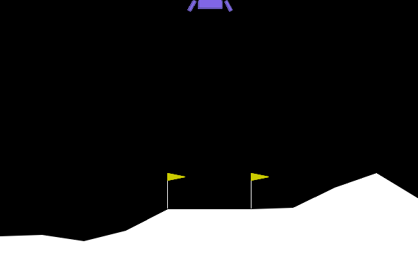

# Lunar Lander Lab

[](https://github.com/JFrusher/Lunar-Lander/actions/workflows/ci.yml)
[](LICENSE)

A Python workspace for experimenting with classical (rule-based) control and
reinforcement learning on Gymnasium's `LunarLander-v3`.

<p align="center">
  
  
  <br>
  <em>PPO (left) and the hand-tuned heuristic controller (right).</em>
</p>

## Results

A per-step time penalty of 0.1 during PPO training buys **22% faster
landings at no cost to reward or success rate** — and does nothing at all
to the heuristic controller. Three seeds per point, evaluated on held-out
episodes.


| controller | penalty | reward | success | landing steps |
|---|---|---|---|---|
| PPO | 0.0 | 261.2 ± 4.8 | 99.3% | 321 |
| **PPO** | **0.1** | **272.0 ± 5.3** | **99.0%** | **250** |
| PPO | 0.4 | 70.0 ± 17.2 | 13.7% | — |
| Heuristic | 0.0 | 246.8 ± 2.4 | 97.3% | 401 |
| Heuristic | 0.4 | 248.5 ± 2.9 | 97.0% | 388 |

Each row is the mean over 3 independent runs at that penalty level — for
the heuristic, 3 fresh gain searches; for PPO, 3 training runs.

The penalty shapes what PPO *learns*, but for the heuristic it only
re-ranks a fixed pool of already-sampled gain sets — so it applies no
search pressure and cannot produce a faster controller.

**PPO needs ~400k timesteps to land at all**, and 1M to do it well; below
that it fails outright rather than merely underperforming.

### Making the heuristic faster

Two mechanisms the penalty sweep never tried, measured on 200 held-out
episodes the search never saw:

| heuristic config | steps | success | reward | fuel |
|---|---|---|---|---|
| previous shipped gains | 396.3 | 100.0% | 251.3 | 11305 |
| previous gains + 15-step engine lockout | 370.7 | 98.5% | 253.3 | 10692 |
| **current shipped gains** | **374.7** | **99.5%** | **255.6** | **10507** |
| current gains + 15-step engine lockout | 351.6 | 97.5% | 254.0 | 9846 |


Blocking the main engine for the first 15 steps forces an efficient
free-fall instead of an early hover, and it stacks with re-picking the gains
for speed rather than reward — **−11.3% together**, on 12.9% *less* fuel.
Longer lockouts collapse both controllers; the transition is a ramp, not a
cliff, and finding that needed a grid fine enough to see it.

How much is left? A point-mass minimum-time descent puts the floor well
below what either controller achieves:


📖 **[Read the full investigation →](INVESTIGATION.md)** — six methodology
bugs, most of them caught by treating a suspiciously clean number as a bug
report against my own analysis.

## Project Structure

```
Lunar/
├── README.md
├── LICENSE
├── pyproject.toml
├── .github/workflows/ci.yml   # lint + fast/slow test jobs
├── tests/                     # pytest suite (see Testing below)
├── runs/                      # gitignored — all run output, kept forever
│   ├── train/<timestamp>/     # PPO checkpoints (.zip)
│   ├── pid_search/<timestamp>/ # gain-sweep datasets + plots
│   ├── ppo_convergence/<timestamp>/ # timestep-budget convergence curves
│   ├── ppo_search/<timestamp>/ # PPO hyperparameter sweep datasets
│   ├── multi_seed_sweep/<timestamp>/ # multi-seed sweeps + error-bar charts
│   └── benchmark/<timestamp>/ # comparison charts
└── lunar_lander_lab/
    ├── cli.py                 # CLI entry point
    ├── configs/
    │   └── heuristic_gains.json   # tuned heuristic gains, hand-updated from sweeps
    ├── controllers/
    │   ├── base.py             # BaseController abstract interface
    │   ├── heuristic.py         # HeuristicController: rule-based PID-style logic
    │   └── rl_agent.py          # RLAgent: PPO wrapper (Stable-Baselines3)
    └── utils/
        ├── paths.py             # runs/ directory helpers
        ├── evaluation.py        # run_benchmark(): head-to-head controller comparison
        ├── pid_search.py        # Monte Carlo gain sweep
        ├── ppo_convergence.py   # how many timesteps PPO actually needs
        ├── ppo_search.py        # Monte Carlo PPO hyperparameter sweep
        └── time_penalty.py      # time-penalty reward shaping + multi-seed sweeps
```

## Setup

```bash
python -m venv .venv
.venv\Scripts\activate        # Windows
source .venv/bin/activate     # macOS/Linux
pip install -e .
```

Requires Python 3.10-3.12 (Box2D and PyTorch wheels; newer interpreters may
lack prebuilt wheels for these packages).

For the test and lint toolchain, install the `dev` extra instead:

```bash
pip install -e ".[dev]"
```

## Testing

```bash
pytest              # fast suite (~5s) — pure logic, no environments
pytest -m slow      # real Gymnasium episodes
pytest -m ""        # everything
ruff check .        # lint
```

Tests that step a real environment or train a real model are marked `slow`
and excluded by default, so the common case stays fast. CI runs both sets.

## CLI Usage

Runnable from anywhere once installed, as `lunar-lander`, or from the repo
root as `python -m lunar_lander_lab.cli`.

### Render a controller landing an episode

```bash
lunar-lander run --controller heuristic
lunar-lander run --controller rl
```

Opens a Pygame window and renders one episode. `--controller rl` loads the
most recently trained checkpoint under `runs/train/` (or pass an explicit
path with `--model`).

### Train a PPO agent

```bash
lunar-lander train --timesteps 100000
```

Trains a PPO policy (Stable-Baselines3, `MlpPolicy`) on `LunarLander-v3` and
saves the checkpoint to `runs/train/<timestamp>/ppo_lunar_lander.zip`.

### Benchmark controllers side-by-side

```bash
lunar-lander benchmark --episodes 50
```

Runs the heuristic controller and (if trained) the PPO agent across the same
set of seeds, prints a metrics table (mean reward, success/landing rate,
average flight time, crash rate), and saves a comparison chart to
`runs/benchmark/<timestamp>/benchmark_results.png`.

### Sweep heuristic gains

```bash
lunar-lander pid-search --samples 200 --episodes 30
```

Latin-Hypercube-samples the gain space, evaluates each set across seeded
episodes (multiprocessed), and writes a dataset + plots to
`runs/pid_search/<timestamp>/`. Use `--param-space extended` for the 8D
space that also sweeps the three attitude gains.

The reported winner is **not** the best score on the search episodes. The
top-k are re-scored on episodes the search never saw, and those decide —
otherwise the reported best is inflated by up to 30 reward, since it's the
maximum of N noisy estimates. `best_gains.json` records the gap as
`search_set_optimism`.

To apply a winning sweep: open `runs/pid_search/<timestamp>/best_gains.json`
and hand-copy its `best_gains` values into
`lunar_lander_lab/configs/heuristic_gains.json`. This is a deliberate manual
step — a smaller or noisier sweep shouldn't be able to silently regress the
tuned default.

### Measure how long PPO needs to train

```bash
lunar-lander ppo-convergence-check
```

Trains PPO from scratch at increasing timestep budgets with a fixed seed and
evaluates each, writing a convergence curve to
`runs/ppo_convergence/<timestamp>/`. Worth running before trusting any RL
result: below ~400k timesteps this agent doesn't land at all.

### Sweep PPO hyperparameters

```bash
lunar-lander hparam-search --samples 30
```

Latin-Hypercube-samples `learning_rate`, `n_steps`, `ent_coef`, `gamma` and
`gae_lambda`, trains one policy per sample (multiprocessed), and ranks them
with the same held-out re-scoring `pid-search` uses. Expensive — roughly 7
minutes per config at the 1M-timestep default.

### Sweep the time penalty

```bash
lunar-lander time-penalty-sweep          # single seed
lunar-lander multi-seed-sweep            # 3 seeds, with error bars
```

Trains/tunes both controllers at each penalty level and plots the landing
speed / reward trade-off. `multi-seed-sweep` repeats across seeds and
aggregates mean ± std — the chart in [Results](#results). Both evaluate on
natural (unpenalized) reward, so the penalty never scores its own effect.

### View training curves

`RLAgent.train()` takes an optional `tensorboard_log` directory:

```python
RLAgent().train(total_timesteps=1_000_000, tensorboard_log="runs/tensorboard/my_run")
```

```bash
tensorboard --logdir runs/tensorboard    # needs the dev extra
```

Off by default — the sweeps train dozens of models per run and don't all
want the extra writes. Worth switching on when a single run's behaviour
*over time* matters rather than its final score.

### Record a demo GIF

```bash
python scripts/record_demo.py --controller rl --output docs/media/rl_landing.gif --require-landing
```

Renders an episode via `rgb_array` and encodes it with `imageio` (install
the `dev` extra first). Reproducible, unlike a screen capture.

## Controllers

- **`HeuristicController`** — proportional control on horizontal position,
  velocity, angle and descent speed. Swept gains load from
  `configs/heuristic_gains.json`; unswept gains are class attributes.
- **`RLAgent`** — trains/loads a PPO model and selects actions via
  `model.predict(obs, deterministic=True)`.

Both implement `BaseController.get_action(observation) -> int`, so new
controllers can be dropped in and benchmarked the same way.
