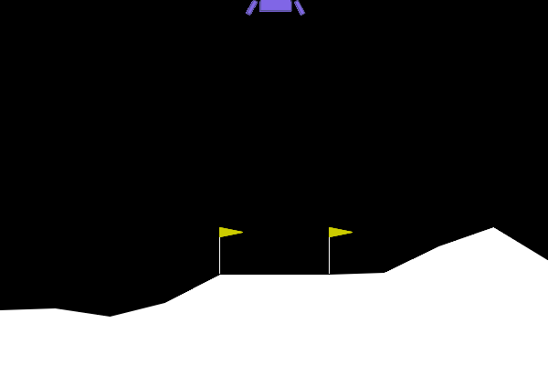
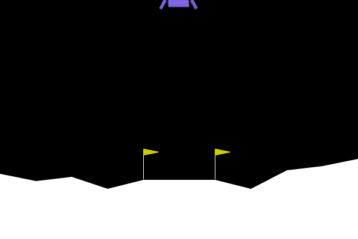
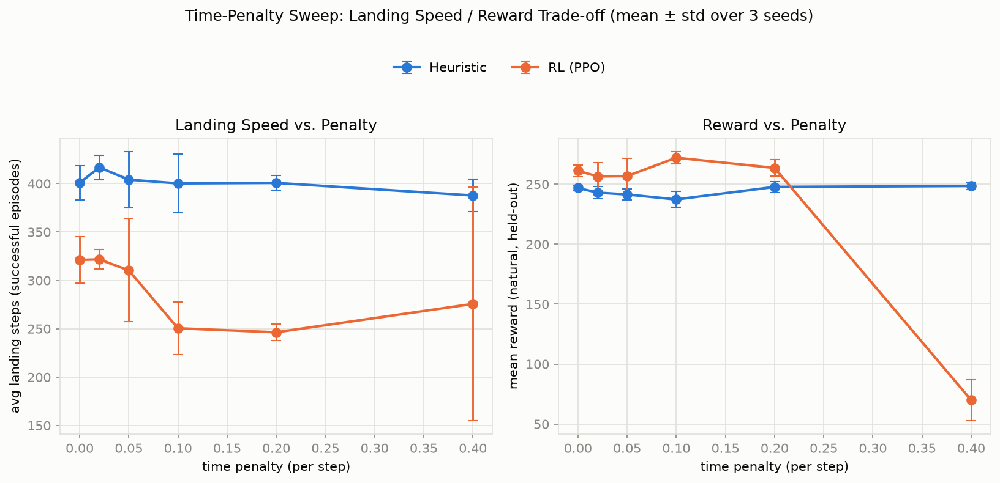
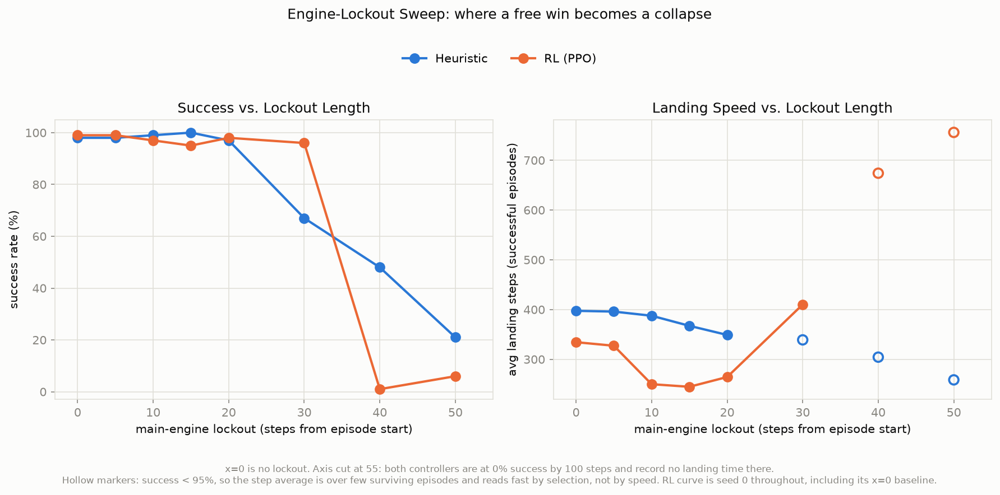
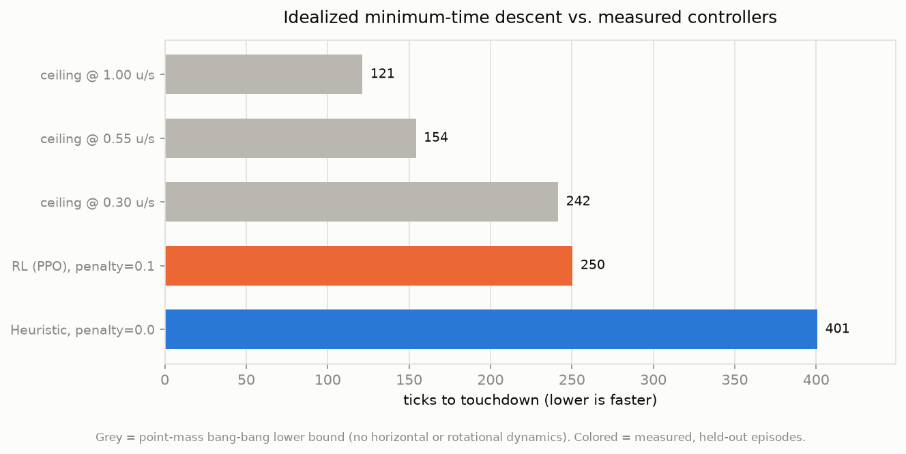
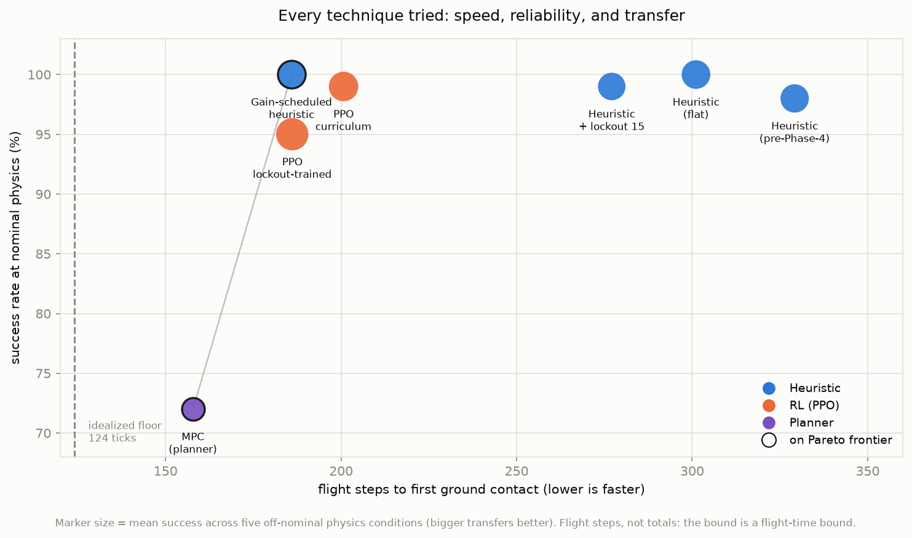

# Lunar Lander Lab

[](https://github.com/JFrusher/Lunar-Lander/actions/workflows/ci.yml)
[](LICENSE)

A Python workspace for messing around with classical (rule-based) control
and reinforcement learning on Gymnasium's `LunarLander-v3`.

<p align="center">
  
  
  <br>
</p>

## Results

A per-step time penalty of 0.1 during PPO training buys 22% faster
landings at basically no cost to reward or success rate. It does nothing
at all to the heuristic controller, though. Three seeds per point,
evaluated on held-out episodes.



| controller | penalty | reward | success | landing steps |
|---|---|---|---|---|
| PPO | 0.0 | 261.2 ± 4.8 | 99.3% | 321 |
| **PPO** | **0.1** | **272.0 ± 5.3** | **99.0%** | **250** |
| PPO | 0.4 | 70.0 ± 17.2 | 13.7% | — |
| Heuristic | 0.0 | 246.8 ± 2.4 | 97.3% | 401 |
| Heuristic | 0.4 | 248.5 ± 2.9 | 97.0% | 388 |

Each row is the mean over 3 independent runs at that penalty level.

PPO needed about 400k timesteps just to land at all, and 1M to do it
well. Below that it just fails outright, no partial credit.

### Making the heuristic faster

There were two mechanisms the penalty sweep never touched, measured on
200 held-out episodes the search never saw:

| heuristic config | steps | success | reward | fuel |
|---|---|---|---|---|
| previous shipped gains | 396.3 | 100.0% | 251.3 | 11305 |
| previous gains + 15-step engine lockout | 370.7 | 98.5% | 253.3 | 10692 |
| **current shipped gains** | **374.7** | **99.5%** | **255.6** | **10507** |
| current gains + 15-step engine lockout | 351.6 | 97.5% | 254.0 | 9846 |



Blocking the main engine for the first 15 steps forces an efficient
free-fall instead of an early hover, and it stacks with re-picking the
gains for speed instead of reward: 11.3% faster together, on 12.9% less
fuel. Longer lockouts collapse both controllers. The transition is a
ramp, not a cliff, and finding that out took a grid fine enough to
actually see it.

So how much speed is still on the table? A point-mass minimum-time
descent puts the floor well below what either controller achieves:



### Everything I tried, and what it cost



| controller | flight steps | success | off-nominal success |
|---|---|---|---|
| **MPC (planner)** | **157.8** | 72.0% | 30.6% |
| **Gain-scheduled heuristic** | **185.9** | **100.0%** | 47.8% |
| PPO, lockout-trained | 186.1 | 95.0% | **66.2%** |
| PPO, penalty curriculum | 200.7 | 99.0% | 54.6% |
| Heuristic + 15-step lockout | 277.1 | 99.0% | 47.0% |
| Heuristic (flat) | 301.1 | 100.0% | 51.2% |
| Heuristic (before any of this) | 329.2 | 98.0% | 50.2% |

Bold marks the Pareto frontier. These are *flight* steps, not totals —
about 23% of a LunarLander episode happens after touchdown, while Box2D
settles the lander to sleep, and no controller can fly its way out of
that part.

Flight time fell 52% overall. The single biggest contributor wasn't a
reinforcement-learning technique at all, it was giving the classical
controller different gains at different altitudes. That controller now
matches 1M-timestep PPO on speed and beats it on reliability, and it took
about fifteen minutes of sampling to get there.

Worth a caveat on that comparison: the classical controller has
hand-designed structure baked in that encodes real domain knowledge,
while PPO was just handed an 8-vector and left to figure it out on its
own. What this really says is that the structure is good and the problem
is small, not that policy gradients are bad at their job.

Every controller here is brittle to wind it was never tuned against, and
oddly the one with the *worst* nominal success transfers best — because
training under a forced engine lockout accidentally taught it to recover
from uncontrolled drift. Nothing in this project ever set out to optimize
for robustness; every number in that column showed up by accident.

Four ideas that sounded good on paper and weren't: a continuous action
space makes landings slower (throttle lets the policy cushion the
touchdown, which doubles the settling tail); more time pressure buys no
more speed past a certain point (4× the penalty, no extra gain); planning
is the fastest option but the least reliable, and its failures point in a
specific direction (99% success under weak gravity, 14% under strong,
because its internal model is wrong in a specific direction); and cutting
the engine before touchdown makes settling worse, not better.

📖 **[Read the full investigation →](INVESTIGATION.md)** — six
methodology bugs, most of them caught by getting suspicious of a number
that looked too clean and treating it as a bug report against my own
analysis.

## Project Structure

```
Lunar/
├── README.md
├── LICENSE
├── pyproject.toml
├── .github/workflows/ci.yml   # lint + fast/slow test jobs
├── docs/
│   ├── METHOD.md              # how the project is run: rules, phases, what got killed
│   └── media/                 # the curated, tracked figures the docs link
├── scripts/
│   ├── record_demo.py         # reproducible demo GIFs via rgb_array
│   └── regen_speed_media.py   # rebuild docs/media/ from runs/
├── tests/                     # pytest suite (see Testing below)
├── runs/                      # gitignored — all run output, kept forever
│   ├── train/<timestamp>/     # PPO checkpoints (.zip)
│   ├── pid_search/<timestamp>/ # gain-sweep datasets + plots
│   ├── gain_schedule/         # altitude-banded gain searches
│   ├── robustness/<timestamp>/ # off-nominal physics transfer checks
│   └── …                      # one directory per study, timestamped
└── lunar_lander_lab/
    ├── cli.py                 # CLI entry point
    ├── configs/
    │   ├── heuristic_gains.json    # tuned flat gains, hand-promoted from sweeps
    │   └── scheduled_gains.json    # tuned per-altitude-band gains
    ├── controllers/
    │   ├── base.py             # BaseController abstract interface
    │   ├── heuristic.py        # rule-based proportional controller
    │   ├── scheduled_heuristic.py  # …with gains scheduled by altitude band
    │   ├── rl_agent.py         # PPO wrapper (Stable-Baselines3)
    │   └── mpc.py              # receding-horizon planner (CEM)
    └── utils/
        ├── paths.py            # runs/ directory helpers
        ├── evaluation.py       # run_benchmark(): head-to-head comparison
        ├── pid_search.py       # Monte Carlo gain sweep + held-out selection
        ├── speed_ceiling.py    # idealized minimum-time descent bound
        ├── marking.py          # segment-by-segment report cards
        ├── robustness.py       # off-nominal physics transfer
        ├── lockout_sweep.py    # engine-lockout gating study
        ├── penalty_curriculum.py   # annealed time penalty
        ├── continuous_compare.py   # discrete vs continuous action space
        ├── ppo_convergence.py  # how many timesteps PPO actually needs
        ├── ppo_search.py       # Monte Carlo PPO hyperparameter sweep
        └── time_penalty.py     # reward-shaping wrappers + evaluation metrics
```

## Setup

```bash
python -m venv .venv
.venv\Scripts\activate        # Windows
source .venv/bin/activate     # macOS/Linux
pip install -e .
```

Requires Python 3.10-3.12 (Box2D and PyTorch wheels; newer interpreters may
lack prebuilt wheels for these packages).

For the test and lint toolchain, install the `dev` extra instead:

```bash
pip install -e ".[dev]"
```

## Testing

```bash
pytest              # fast suite (~5s) — pure logic, no environments
pytest -m slow      # real Gymnasium episodes
pytest -m ""        # everything
ruff check .        # lint
```

Tests that step a real environment or train a real model are marked `slow`
and excluded by default, so the common case stays fast. CI runs both sets.

## CLI Usage

Runnable from anywhere once installed, as `lunar-lander`, or from the repo
root as `python -m lunar_lander_lab.cli`.

### Render a controller landing an episode

```bash
lunar-lander run --controller scheduled --loop     # the fastest reliable one
lunar-lander run --controller heuristic
lunar-lander run --controller mpc
lunar-lander run --controller rl
```

Opens a Pygame window and renders episodes, printing steps split into
**flight + settling** — about a quarter of a "landing" happens after
touchdown while Box2D settles the lander, and no controller can shorten it.

`--controller rl` loads the most recently trained checkpoint under
`runs/train/` (or pass an explicit path with `--model`). `--gains` flies an
alternative gain file, which is how you compare a tuned controller against
its predecessor side by side. `--lockout-steps` / `--lockout-altitude` block
the main engine for part of the descent.

### Train a PPO agent

```bash
lunar-lander train --timesteps 100000
```

Trains a PPO policy (Stable-Baselines3, `MlpPolicy`) on `LunarLander-v3` and
saves the checkpoint to `runs/train/<timestamp>/ppo_lunar_lander.zip`.

### Benchmark controllers side-by-side

```bash
lunar-lander benchmark --episodes 50
```

Runs the heuristic controller and (if trained) the PPO agent across the same
set of seeds, prints a metrics table (mean reward, success/landing rate,
average flight time, crash rate), and saves a comparison chart to
`runs/benchmark/<timestamp>/benchmark_results.png`.

### Sweep heuristic gains

```bash
lunar-lander pid-search --samples 200 --episodes 30
```

Latin-Hypercube-samples the gain space, evaluates each set across seeded
episodes (multiprocessed), and writes a dataset + plots to
`runs/pid_search/<timestamp>/`. Use `--param-space extended` for the 8D
space that also sweeps the three attitude gains.

The reported winner is **not** the best score on the search episodes. The
top-k are re-scored on episodes the search never saw, and those decide —
otherwise the reported best is inflated by up to 30 reward, since it's the
maximum of N noisy estimates. `best_gains.json` records the gap as
`search_set_optimism`.

To apply a winning sweep: open `runs/pid_search/<timestamp>/best_gains.json`
and hand-copy its `best_gains` values into
`lunar_lander_lab/configs/heuristic_gains.json`. This is a deliberate manual
step — a smaller or noisier sweep shouldn't be able to silently regress the
tuned default.

### Measure how long PPO needs to train

```bash
lunar-lander ppo-convergence-check
```

Trains PPO from scratch at increasing timestep budgets with a fixed seed and
evaluates each, writing a convergence curve to
`runs/ppo_convergence/<timestamp>/`. Worth running before trusting any RL
result: below ~400k timesteps this agent doesn't land at all.

### Sweep PPO hyperparameters

```bash
lunar-lander hparam-search --samples 30
```

Latin-Hypercube-samples `learning_rate`, `n_steps`, `ent_coef`, `gamma` and
`gae_lambda`, trains one policy per sample (multiprocessed), and ranks them
with the same held-out re-scoring `pid-search` uses. Expensive — roughly 7
minutes per config at the 1M-timestep default.

### Sweep the time penalty

```bash
lunar-lander time-penalty-sweep          # single seed
lunar-lander multi-seed-sweep            # 3 seeds, with error bars
```

Trains/tunes both controllers at each penalty level and plots the landing
speed / reward trade-off. `multi-seed-sweep` repeats across seeds and
aggregates mean ± std — the chart in [Results](#results). Both evaluate on
natural (unpenalized) reward, so the penalty never scores its own effect.

### Mark a controller segment by segment

```bash
lunar-lander mark --controllers heuristic scheduled --episodes 30
```

Splits each episode into `DESCENT` / `APPROACH` / `TERMINAL` / `SETTLING`,
grades each segment against the idealized descent plan run from that
episode's own start state, and reports named behaviours (hovering, attitude
oscillation, wasted thrust, lateral wandering).

Grades are `ideal / actual`, capped at 1.0 — beating the idealized plan
would mean the model is wrong, which is a finding to chase rather than a
grade to award. `SETTLING` is ungraded because the descent model stops at
ground contact.

This is what shows that the flat controller's weakness is the *descent*
(grade 0.32) and not the landing (0.85), and that gain scheduling bought
descent speed by giving some terminal quality back.

### Study the descent limits

```bash
lunar-lander speed-ceiling          # idealized minimum-time bound
lunar-lander lockout-sweep          # block the main engine early
lunar-lander penalty-curriculum-sweep   # anneal the time penalty over training
lunar-lander continuous-compare     # discrete vs continuous action space
```

Each writes a timestamped directory under `runs/` with CSVs and plots.

### View training curves

`RLAgent.train()` takes an optional `tensorboard_log` directory:

```python
RLAgent().train(total_timesteps=1_000_000, tensorboard_log="runs/tensorboard/my_run")
```

```bash
tensorboard --logdir runs/tensorboard    # needs the dev extra
```

Off by default — the sweeps train dozens of models per run and don't all
want the extra writes. Worth switching on when a single run's behaviour
*over time* matters rather than its final score.

### Record a demo GIF

```bash
python scripts/record_demo.py --controller scheduled --seed 50014 \
    --output docs/media/scheduled_landing.gif
```

Renders an episode via `rgb_array` and encodes it with `imageio` (install
the `dev` extra first). Reproducible, unlike a screen capture.

## Controllers

- **`HeuristicController`** — proportional control on horizontal position,
  velocity, angle and descent speed. Swept gains load from
  `configs/heuristic_gains.json`; unswept gains are class attributes.
- **`ScheduledHeuristicController`** — the same proportional control, with
  the core gains scheduled by altitude band instead of fixed for the whole
  descent (`configs/scheduled_gains.json`).
- **`MPCController`** — receding-horizon planning via the cross-entropy
  method against an analytical planar model, replanned every step.
- **`LQRController`** — continuous state-feedback control from a Riccati
  solve (`scipy.linalg.solve_continuous_are`), linearized around level
  hover. Uses a continuous action space; every other controller here uses
  the discrete one.
- **`RLAgent`** — trains/loads a Stable-Baselines3 model (PPO, SAC, DQN, or
  TD3 — `--algo` on `lunar-lander train`) and selects actions via
  `model.predict(obs, deterministic=True)`.

All implement `BaseController.get_action(observation)`, so a new controller
can be dropped in and benchmarked the exact same way as these. Each module
registers itself against a name (`lunar_lander_lab/controllers/registry.py`)
via `@register_controller("name")` — that name is what every CLI flag
(`--controller`, `--controllers`) and the dashboard's controller picker
lists; adding a controller means writing the class and one registration
call, not editing `cli.py`.

## Dashboard

```bash
pip install -e ".[dashboard]"
streamlit run lunar_lander_lab/dashboard/app.py
```

A local Streamlit UI over the same machinery the CLI uses — nothing here is
scored or trained differently than `mark`/`benchmark`/`train` already do:

- **Run & Visualize** — pick any registered controller, fly one seeded
  episode, watch it land frame-by-frame.
- **Compare** — pick several controllers, get aggregate metrics
  (`utils/evaluation.py`) and per-segment report cards
  (`utils/marking.py`) side by side.
- **Train** — kick off a real training run (any `--algo`) and tail its
  output live; the checkpoint lands in `runs/train/` exactly as it would
  from the CLI, and the other two tabs pick up the newest one automatically.
