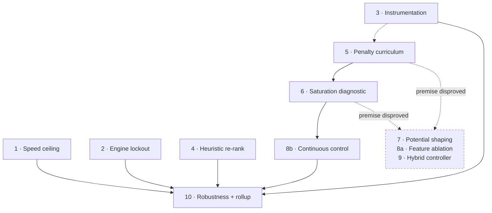

# How this project is run

This is the working method behind the results in
[README.md](../README.md) and the narrative in
[INVESTIGATION.md](../INVESTIGATION.md). It exists because the *process* is
most of what this repo demonstrates — the lander is a pretext.

Work happens in **phases**, planned before they are executed and recorded
after. Each phase states its motivating question, its plan, its expected
cost, and — once run — what actually happened, including when that
contradicted the plan. Phases are executed one per session with gaps in
between, so the plan documents are the only state that carries across; there
is no reliance on conversation history.

## Standing rules

These are enforced across every phase, and most of them exist because
violating them produced a wrong answer first.

| Rule | Why it exists |
|---|---|
| **Search episodes and reporting episodes must be disjoint.** Every search re-scores its top-k on held-out episodes before naming a winner. | Ranking N candidates on the episodes used to score them inflates the winner by up to 30 reward, and the inflation grows with N. |
| **No conclusion from a single seed.** Configurations are repeated across seeds and reported as mean ± std. | Six separate single-seed results in this project looked decisive and did not survive their own repeat. |
| **Where a multi-seed run costs the same wall time as a single-seed run, skip the single-seed stage entirely.** | Parallel workers make 3 seeds free when they fit one batch. Running the cheap version first buys only a number likely to be retracted. |
| **Evaluate on the unmodified objective.** Reward shaping and action constraints apply to training only; scoring always uses natural reward. | Otherwise a technique scores its own effect. |
| **Inherited constants are unvalidated until measured.** | A training budget nobody chose was wrong by ~7x and silently invalidated everything downstream of it. |
| **Tests ship in the same commit as the module they cover.** Anything touching a real environment or training a real model is marked `slow` and excluded by default. | Keeps the common case fast without losing integration coverage. |
| **A suspiciously clean number is a bug report against your own analysis.** | Four identical floats to 15 decimal places, and a "lower bound" slower than the thing it bounds, were both real bugs found this way. |
| **Interrogate the reference as hard as the result.** | A "physical floor" was quoted for two arcs before anyone checked it. It was the best *untilted* strategy, and tilting beat it — so every percentage measured against it was measuring the wrong thing. It felt like infrastructure rather than a claim, which is exactly why it went unchecked. |
| **Decompose the metric before optimising it.** | Total landing steps hid that ~23% is incompressible settling; one reward number hid that the time penalty saturates; one gain set hid that the descent has two regimes. Every significant finding here came from splitting a scalar. |

Some actions always stop for a human: pushing, overwriting the shipped
controller configuration, and any conditional-gate decision.

## Phase status vocabulary

`Not started` · `In progress` · `Blocked` · `Done` · `Skipped — <reason>`

**`Skipped` is a result, not an omission.** A phase whose premise is
disproved before it runs has produced a finding at zero compute cost, and
the reasoning is recorded in full. Five phases across the two arcs ended
this way.

## Arc 1 — from working code to a documented result

Ten phases, all closed. Established the headline: a per-step time penalty of
0.1 during PPO training buys 22% faster landings at no cost to reward or
success rate.

| Phase | Outcome |
|---|---|
| 0 · Reconcile shipped gains | Promoted the corrected sweep's output after a 3-seed check |
| 1 · PPO convergence check | **PPO scores 0% success below 400k timesteps.** Every prior RL result had trained at 150k |
| 2a · PPO hyperparameter sweep | Defaults survived a 30-config challenge — but the first pass's supporting numbers were noise |
| 2b · Heuristic bound audit | Bounds adequate. The phase's own hypothesis was backwards |
| 3 · 8D gain search | No free reward. Found that search-set optimism grows with sample count |
| 4 · Multi-seed error bars | **Overturned the founding premise** — the speed/reward trade-off did not exist |
| 5 · Smarter search | **Skipped** — the space wasn't under-covered, it was over-fit |
| 6 · Altitude-gated penalty | **Skipped** — the trade-off it was designed to fix had been measured away |
| 7 · Testing + CI | pytest suite, GitHub Actions, fast/slow split |
| 8–9 · Presentation + QA | Investigation write-up, figures, fresh-clone verification |

## Arc 2 — chasing landing speed

| Phase | Outcome |
|---|---|
| 1 · Idealized speed ceiling | Point-mass minimum-time bound. Two model bugs caught by an impossible result |
| 2 · Engine-lockout gating | **15-step lockout is optimal for both controllers**, found independently on each |
| 3 · Instrumentation | Touchdown speed + fuel metrics. Caught a 7.5× unit mismatch |
| 4 · Direct-objective re-rank | Faster gains from 17,851 already-collected samples. Success floors don't generalise |
| 5 · Penalty curriculum | **The flat-0.4 collapse is about *when*, not *how much*** — 13.7% → 97.7% success |
| 6 · Adaptive penalty | **Re-scoped.** Found that 23% of a "landing" is incompressible settling |
| 7 · Potential-based shaping | **Skipped** — the technique's central guarantee contradicts the goal |
| 8a · Feature ablation | **Skipped** — the state is Markov, so the features carry no information |
| 8b · Continuous control | Discrete vs continuous action space at matched algorithm and budget |
| 9 · Hybrid controller | **Skipped** — premise contradicted by Phase 6's measurement |
| 10 · Robustness + rollup | Randomised physics, final comparison |

## Arc 3 — new controllers

| Phase | Outcome |
|---|---|
| A · 2-D speed ceiling | **Hypothesis rejected** — extending the bound widened the gap. Also corrected Arc 2: the "ceiling" was the best *untilted* strategy, not a floor |
| B · MPC controller | Fastest flight in the project (157.8) at 72% success. **Model error has a direction**: 99% under weak gravity, 14% under strong |
| C · Gain scheduling | **Largest gain anywhere: flight time −39%**, strictly dominating the flat controller. CMA-ES gate checked, not triggered |
| D · Terminal settling | **Hypothesis rejected** — cutting the engine raises settling, as does cushioning it. Controlled contact is already near-optimal |

Final frontier: a gain-scheduled classical controller at 185.9 flight steps
/ 100% success, tied on speed with 1M-timestep PPO and better on
reliability; MPC faster still at 157.8 / 72%. Everything else is dominated.

## Marking, as standing infrastructure

The last rule in the table above — decompose before optimising — is now a
tool rather than a habit. `lunar-lander mark` splits each episode into
`DESCENT` / `APPROACH` / `TERMINAL` / `SETTLING`, grades each segment against
the idealized descent plan run from that episode's own start state, and
reports named behaviours (hovering, attitude oscillation, wasted thrust,
lateral wandering).

Grades are `ideal / actual`, capped at 1.0: beating the idealized plan means
the *model* is wrong, which is a finding to chase rather than a grade to
award. `SETTLING` is deliberately ungraded, because the descent model stops
at ground contact and has nothing to say about it.

It earned itself immediately, finding two regressions in a controller that
had just been shipped on the strength of a 39% improvement in its total:
terminal-phase quality had dropped (0.85 → 0.66) and it had started burning
20 wasted main-engine frames per episode. Both were invisible to every
aggregate metric used across three arcs.

## What got killed, and on what grounds

The most useful output of a planned phase is sometimes the argument for not
running it. Each of these was written up as a plan first, then refused:

- **Potential-based reward shaping.** Ng et al. (1999) guarantee that the
  shaped MDP shares an optimal policy with the original. That guarantee was
  the phase's stated selling point — and it is precisely what makes the
  technique unable to change the policy toward faster landings. The property
  advertised as the feature is the reason it cannot do the job. *(One
  careful read of the theorem; zero compute.)*
- **Observation feature augmentation.** The environment's 8-dimensional
  observation is the full state. Appended features are deterministic
  functions of it, so they add exactly zero information; only the
  function-approximation inductive bias can change. *(A property of the
  state representation, not an empirical claim.)*
- **Hybrid classical/learned controller.** It assumed each controller was
  better at a different flight phase. Splitting episodes at first ground
  contact showed the learned policy wins both — flight 185 vs 312 steps,
  settling 56 vs 66. There is no phase for the classical controller to
  specialise in. *(Only knowable because an earlier phase measured the two
  segments separately; on totals alone it would still have looked
  plausible.)*
- **Smarter search (CMA-ES).** The gate condition — "is Latin Hypercube
  under-covering the space?" — was checked against real data. The best-found
  value rose monotonically with sample count on the search set and not at
  all on held-out episodes. The space wasn't under-covered; the objective was
  grading its own homework.
- **Altitude-gated time penalty.** Designed to buy speed without paying
  reward. A later phase measured the payment at zero, leaving nothing to
  buy out.

## Deviations from plan, and why they are recorded

Plans are written before the evidence exists, so several were wrong. The
deviations are kept in the phase records rather than edited away:

- Phase 8b specified SAC. SAC changes the action space, the algorithm and
  the on/off-policy family simultaneously, so a win could not be attributed
  to any of them. Run as continuous-PPO instead — one variable, and cheaper.
- Phase 5 specified a single-seed shape comparison followed by a multi-seed
  confirm. Both fit one batch of workers, so the single-seed stage was
  dropped. One of the two shapes turned out to swing between 12% and 88%
  success across seeds; a single-seed pass had a coin-flip chance of
  reporting the opposite conclusion.
- Phase 6 was re-scoped entirely after the preceding phase both invalidated
  its performance rationale and delivered its stated output.
